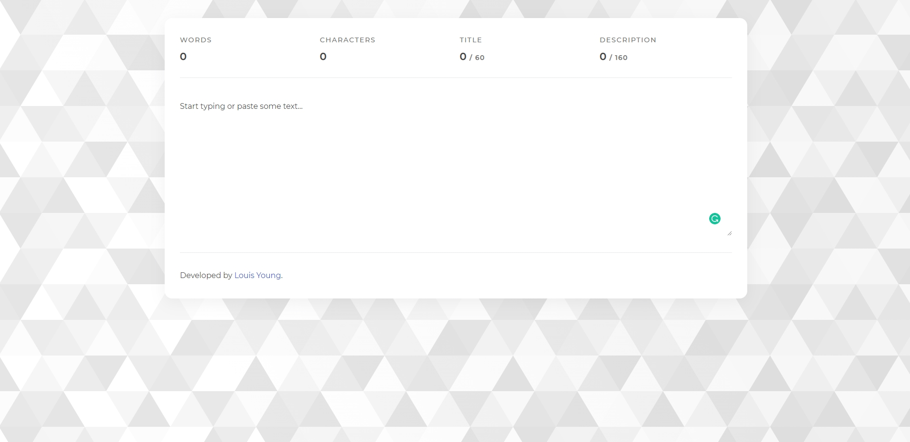

⚠️ Please note that this is an old project and does not reflect the quality of my current work.

# Word Counter Tool

A word and character counter tool.

## Description

A word and character counter tool that counts the amount of characters and words within the given content, and provides visual progress indicators showing how close the content is to the recommended length of a specific piece of META data.

## Motivation

This project was built to aid colleagues at a web development agency in writing content for website search engine optimisation (SEO and META data) and social media marketing.

## Technologies

- JavaScript.
- React.
- Sass (BEM).

---

This project was bootstrapped with [Create React App](https://github.com/facebook/create-react-app).

### Available Scripts

In the project directory, you can run:

#### `npm start`

Runs the app in the development mode.\
Open [http://localhost:3000](http://localhost:3000) to view it in the browser.

The page will reload if you make edits.\
You will also see any lint errors in the console.

#### `npm test`

Launches the test runner in the interactive watch mode.\
See the section about [running tests](https://facebook.github.io/create-react-app/docs/running-tests) for more information.

#### `npm run build`

Builds the app for production to the `build` folder.\
It correctly bundles React in production mode and optimizes the build for the best performance.

The build is minified and the filenames include the hashes.\
Your app is ready to be deployed!

See the section about [deployment](https://facebook.github.io/create-react-app/docs/deployment) for more information.

